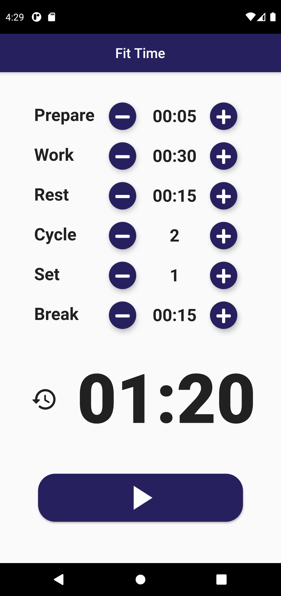

# fit_time_getx

Your workout time tracker. A simple app for tracking and timing your workout.

## About
This project is for learning GetX package for state management and route navigation.

## What is GetX?
GetX is an extra-light and powerful solution package for Flutter. It combines high-performance state management, intelligent dependency injection, and route management quickly and practically. <https://pub.dev/packages/get>

 

